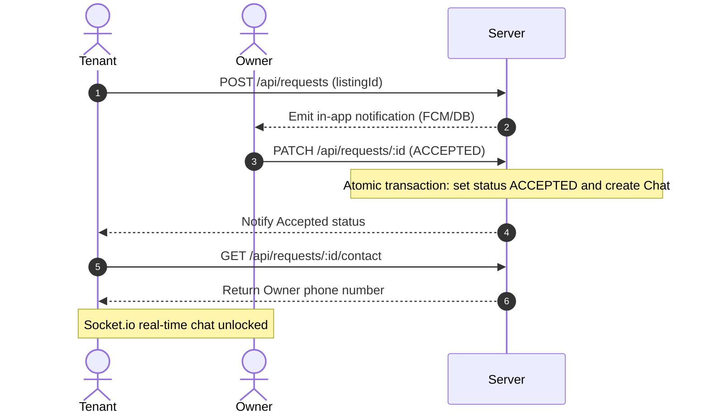

# Quikden — Architecture & Codebase Documentation

Quikden is India's easiest platform to find rental houses, hostels, paying guest (PG) accommodations, roommate share listings, and manage listings for property owners.

---

## Workspace Directory Map

The Quikden workspace is divided into two primary sub-projects: `backend` (Node.js/Express api) and `web` (React/Vite single-page client).

```
quikden/
├── backend/                  # Server-side APIs and services
│   ├── prisma/               # Prisma Database schemas and seeds
│   └── src/
│       ├── controllers/      # Route request handler logic
│       ├── middleware/       # JWT auth, error formatting, inputs validation
│       ├── routes/           # API path declarations & middleware bindings
│       ├── scripts/          # DB data fixes and maintenance scripts
│       ├── services/         # Third-party integrations (Cloudinary, Socket, AI)
│       └── utils/            # Custom errors, async wrappers, DB clients
└── web/                      # Client-side web portal
    ├── public/               # Static assets & Manifest JSON
    └── src/
        ├── assets/           # Media elements (images, logo)
        ├── components/       # Reusable React components (maps, search, layout)
        ├── config/           # Firebase/SDK configurations
        ├── context/          # Global React state contexts (auth, socket)
        ├── locales/          # Localization translations (en, hi, te, ur)
        ├── pages/            # Core views & Dashboards (guest, tenant, owner, admin)
        ├── services/         # API HTTP Client client-requests mapping
        └── utils/            # Helper functions (caching, formatting, compression)
```

---

## File-by-File Detailed Functionality

### 1. Backend Codebase (`backend/src/`)

#### Server Setup & Routing
* **`index.js`** *(Server Bootstrapper)*
  - Entrypoint of the backend application.
  - Sets up Express, configures CORS and JSON parsers, registers request and cookie parsing middlewares.
  - Initialises HTTP and Socket.io servers, mounting paths dynamically to routes defined under `routes/`.
  - Configures global error handling logic using `error.middleware.js`.

#### Controllers (`backend/src/controllers/`)
* **`auth.controller.js`** *(User Authentication)*
  - Handles `/register` and `/login` requests, implementing roles verification (Tenant, Owner) and checks for banned user status.
  - Creates JWT access tokens (expires in 15m) and refresh tokens (expires in 7d).
  - Handles HttpOnly cookie rotations, logout flows, and user profile queries `/me`.
  - Manages patch requests for FCM tokens.
* **`chat.controller.js`** *(Chat Threads Management)*
  - Retrieves a list of active conversation threads (`/api/chats/`) with the last message contents, sender details, and aggregate unread counts.
  - Retrieves paginated messages history for a given chatId (`/api/chats/:id/messages`) and flags unread messages as read.
* **`listing.controller.js`** *(Listing CRUD)*
  - Implements complete CRUD lifecycle for listings (House, Room, Hostel, Land).
  - Handles nested relations: creates and updates secondary tables such as `Amenities`, `RoomSharing`, `HostelSharing`, and `HostelSharingTiers`.
  - Manages listing states (`ACTIVE`, `PAUSED`, `RENTED`).
  - Handles view count increments asynchronously (fire-and-forget).
* **`notification.controller.js`** *(In-app Alerts history)*
  - Exposes endpoints to retrieve the latest 50 notifications, mark individual notification read, or mark all as read.
* **`report.controller.js`** *(Content Moderation Flags)*
  - Handles reporting a listing.
  - Handles admin listing query of reports and status patch requests (`OPEN`, `RESOLVED`, `DISMISSED`).
* **`request.controller.js`** *(Rental & roommate requests flow)*
  - Processes tenancy requests. Prevents duplicate requests or self-requests.
  - Handles request approvals/rejections by owners. Approving atomic-creates a Chat room.
  - Reveals owner phone number upon acceptance.
* **`review.controller.js`** *(Trust ratings)*
  - Manages feedback ratings (1-5 stars) and comments. Prevents duplicate submissions and self-rating.
  - Recalculates user overall rating average (`avgRating`) and total feedback counters.
* **`saved.controller.js`** *(Wishlists)*
  - Toggles saving/unsaving properties and queries tenant-saved lists.
* **`search.controller.js`** *(Search Engines)*
  - Combines SQL full-text searches with multi-field parameters (city, budget, type).
  - Triggers the AI prompt query parsing service or invokes the regex fallback mapping.
* **`upload.controller.js`** *(Cloudinary upload integrations)*
  - Accepts image arrays (multer) and routes them to Cloudinary (compresses to JPG, limits size).
  - Manages deletion endpoints (removes files from database and triggers deletion on Cloudinary servers).
* **`user.controller.js`** *(Profiles)*
  - Exposes public profile information and handles user bio or name updates.
* **`xiayoki.controller.js`** *(Chatbot router API)*
  - Processes input query parameters, retrieves chat context history, forwards requests to the AI bot agent service, and returns structured navigation buttons in JSON.

#### Middleware (`backend/src/middleware/`)
* **`auth.middleware.js`** *(Session validations)*
  - Standard JWT token validation checks. Extractor attaches current profile details. Blocks access to banned accounts. Supports optional extractor mode (allows guest requests through).
* **`error.middleware.js`** *(Error formatter)*
  - Translates operational exceptions and database codes (Prisma duplicate key warnings, syntax errors) into structured JSON responses.
* **`validate.middleware.js`** *(Input filters)*
  - Integrates `express-validator` to intercept and check input payloads (fields formatting, requirements, values ranges) before hitting controllers.

#### Routes (`backend/src/routes/`)
* Declares standard REST path setups linking specific controller callbacks to routes (e.g. `/api/auth`, `/api/listings`, `/api/search`, `/api/chats`, `/api/admin`, etc.).

#### Services (`backend/src/services/`)
* **`ai.service.js`** *(OpenRouter LLM Interface)*
  - Interacts with OpenRouter endpoints using model configurations to interpret plain text inputs and translate them into query parameters.
* **`auth.service.js`** *(JWT Signer)*
  - Utilities for token generation, verification, and rotation.
* **`cloudinary.service.js`** *(Media Storage Client)*
  - Handles Cloudinary API actions (image uploads, gravity-cropped profile photos, delete assets).
* **`email.service.js`** *(Mailer)*
  - Handles transactional emails (welcome notifications, verification checks).
* **`notification.service.js`** *(Alerts Broadcaster)*
  - Multiplexes alerts: creates DB notification entries, sends push alerts via FCM for PWAs, and pushes web-push updates.
* **`socket.js`** *(Real-Time Server)*
  - Handles Socket.io connections: joins active chat rooms, broadcasts typing events, registers seen states, and emits incoming real-time messages.
* **`xiayoki.service.js`** *(Chatbot Agent)*
  - Stores system prompt persona guidelines for the assistant, handles conversational threads, formats answers, and embeds clickable route redirects.

#### Utilities (`backend/src/utils/`)
* **`AppError.js`** - Custom error class extension identifying operational errors.
* **`asyncHandler.js`** - Eliminates repetitive try-catch blocks in Express controller callbacks.
* **`prisma.js`** - Initialises the singleton instance of the Prisma client database connector.

---

### 2. Frontend Web Codebase (`web/src/`)

#### State & Config Providers
* **`main.jsx`** *(Bootstrap)*
  - Binds App container, React Query Cache manager, Socket connection provider, and session contexts.
* **`i18n.js`** *(Localisation)*
  - Configurations for English, Hindi, Telugu, and Urdu language maps.
* **`context/AuthContext.jsx`** *(User State Provider)*
  - Stores current session details, intercepts API responses to automatically handle JWT rotations, and exposes login and logout functions.
* **`context/SocketContext.jsx`** *(Real-Time Communications)*
  - Establishes connection state to the socket server, syncs typing indicators, tracks unread counts, and updates chat screens.
* **`config/firebase.js`** - Stores configurations for Firebase PWA push alerts.

#### Base Layouts (`web/src/components/layout/`)
* **`Navbar.jsx`** *(Navigation Top Bar)*
  - Handles logo display, language selector dropdown, in-app notifications panels (swipe-to-delete), avatar menu redirects, and public mobile menu drawer.
* **`IconSidebar.jsx`** & **`Sidebar.jsx`** *(Side Panel layout)*
  - Responsive dashboards control panels mapping specific paths (listings, saved, profile).
* **`DashboardLayout.jsx`** - Main wrapper structure binding sidebar and pages.
* **`ProtectedRoute.jsx`** - Restricts path listings to registered users or specific roles.

#### Core Page Views (`web/src/pages/`)
* **`HomePage.jsx`** *(Landing Portal)*
  - Includes search bars, popular city links, recent listings grids, and stats.
* **`SearchPage.jsx`** *(Search Portal)*
  - Hosts dual-mode toggle search (Basic and AI options) with filter sliders, badges, and paginated results list.
* **`ListingDetail.jsx`**, **`RoomDetail.jsx`**, **`HostelDetail.jsx`**, **`LandDetail.jsx`** *(Details)*
  - Formats image galleries, details (rent, maintenance, availability, rules), maps, lists nearby amenities, lets user save to wishlist, write reviews, and send a booking request.
* **`LoginPage.jsx`** & **`RegisterPage.jsx`** *(Authentication)*
  - Multi-form credentials validation screens.

#### Dashboards Pages (`web/src/pages/dashboard/`)
* **`TenantDashboard.jsx`** & **`OwnerDashboard.jsx`** *(Dashboards)*
  - Summarises user metrics (Wishlisted, Active requests, Chats, Views) using glass-card widgets.
* **`CreateListing.jsx`** *(Listing Builder)*
  - Forms with conditional fields based on listing type (amenities checklists, hostel occupancy tiers, land specifics) and maps coordinates picker.
* **`RequestsPage.jsx`** - Manages requests history and approvals.
* **`SavedPage.jsx`** - Grid lists user bookmarked items.
* **`ChatPage.jsx`** - Handles real-time chats with typing indicators and image upload fallbacks.

#### Reusable Utility Components (`web/src/components/`)
* **`MapView.jsx`** - Leaflet canvas plotting coordinates with privacy offsets.
* **`LocationPicker.jsx`** - OpenStreetMap pin drop mapping tool.
* **`NearbyPlaces.jsx`** - Overpass API scanner listing facilities in radius.
* **`ImageGallery.jsx`** - Carousel gallery overlay.
* **`xiayoki/XiayokiChatbot.jsx`** *(Draggable Bot FAB)*
  - Renders the floating chatbot.
  - Implements pointer and touch event drag tracking.
  - Feeds drag displacements to target styled containers using CSS variables, while disabling dragging animations on mobile screens.

#### Client Utils (`web/src/utils/`)
* **`compressImage.js`** - Resizes and compresses image attachments before uploads to save bandwidth.
* **`helpers.js`** - Currency formatters, time-ago text, and distance validators.

---

## Architecture & Flows

### Authentication Flow

```mermaid
sequenceGroup Auth JWT Flow
    Client ->> Server: login (credentials)
    Server -->> Client: returns accessToken (JSON) + HttpOnly refreshToken (Cookie)
    Note over Client: Stores accessToken in state; attaches header Bearer token to all Axios calls.
    ... 15 minutes passes ...
    Client ->> Server: Any request (expired token)
    Server -->> Client: 401 Unauthorized
    Client ->> Server: /api/auth/refresh (Cookie read)
    Server -->> Client: new accessToken (JSON)
    Client ->> Server: Re-runs original request
```

### Tenancy Request & Chat Creation Flow


